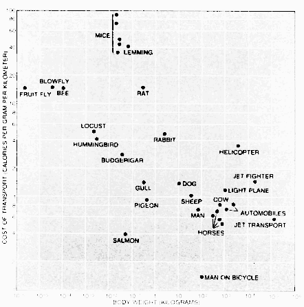

# Why Computation?

---

> Any sufficiently advanced technology is indistinguishable from magic.
>
> - Arthur C. Clark

---

---

## Antikythera Mechanism

- Oldest known computer
- Dated to around 200BCE
- Found in a shipwreck off the coast of the Greek island Antikythera in 1901
- Accurately computes positions of astronomical bodies and dates of eclipses

---

---

What did you learn about bicycles?

---

Why did we read about bicycles?

---

---

](media/jobs-bicycle.webm){height=540px}

---

> To me programming is more than an important practical art. It is also a gigantic undertaking in the foundations of knowledge.
>
> David Sayre

## What are computers capable of?

## Capabilities

- Perform mathematical operations
- Store data
- Retrieve data

## How do computers function

- Retrieve information from data storage (RAM, drives, network, etc)
- Perform mathematical operations on data

## How does the computer know which operations to perform?

## Solving Problems

- In order to solve complex problems, we need to decompose them to subproblems solvable with simple instructions
- Computers (or humans) can execute the basic instructions

---

](media/cot.png)

## Executing Instructions

- Computer programs are instructions to follow to solve our problem
- Instructions must be complete and unambiguous
- It is not easy to craft correct instructions

## Instruction Example
