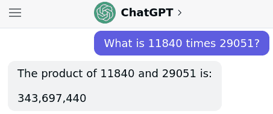
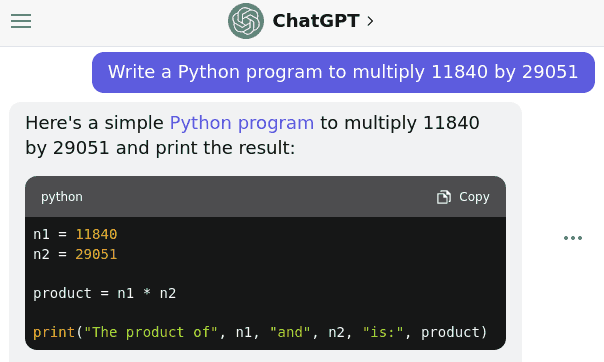

# Instructing Computers

## Telling a Computer What to Do

- Natural Langugage
- Applications
- Programming

## Natural Language

- Comfortable for humans
- Lacks specificity
- Lacks precision
- Difficult for computers to interpret perfectly

## Ambiguous Language

The professor said on Monday he would give an exam.

## Ambiguous Language

> One morning, I shot an elephant in my pajamas. How he got in my pajamas I don't know.
>
> —Groucho Marx

## Large Language Models

- Completions are inherently stochastic
- Results may not be exactly correct or what a user intends
- Need precise inputs to match precise requirements

---

---

## Large Language Models

- Incredibly powerful tools
- Growing more powerful rapidly
- Still require expert knowledge for many use cases

## Apps

- Another approach to instructing computers
- Work well for pre-defined tasks
- Must be created by someone

## Programming

- Provides direct instruction to the computer
- Can be used to compute anything computable
- This can do nearly anything

## Programming

- Not just for experts
- Can be a satisfying, creative experience
- Opens up new means for intellectual expression
- Is basically a superpower

## Programming Challenges

- Learning a new language
- Understanding what computers _can_ do efficiently
- Solving problems algorithmically

## Problem Solving

- Required to program computers
- Analysis at appropriate level of abstraction

## Computational Thinking

Formulating problems such that solutions can be represented as computational steps

## Process

- Problem Formulation - Conceptualize a problem
- Solution Expression - Formulate unambiguous algorithm
- Execution - Computer runs instructions to produce result
- Evaluation - User explores result to confirm thinking

## Algorithm

- Step-by-step process to solve a problem

## Example Problems

## Simple Computer

- Tape-based computer with programmable head
- The number under the head can be `scanned`
- One number can be `stored` in the head
- A `counter` in the head can be incremented

---

{height=540px}

---

{height=540px}

## Instructions

- Move head left
- Move head right
- Stop if `scanned` is empty
- Stop if `scanned` matches `stored`
- Increment `counter`
- Increment `counter` if `stored` matches `scanned`
- Repeat

---

Count the number of items on the tape

`counter` should be equal to the count of the items on the tape when the machine stops

## Counting

1. Stop if `scanned` is empty
2. Increment `counter`
3. Repeat

---

Search through list for an item matching `stored`

The machine head should stop with the head on the first match if there is a match or stop after the end of the list if there is no match.

---

## Search

1. Stop if `scanned` matches `stored`
2. Stop if `scanned` is empty
3. Move head right
4. Repeat

---

Count the number of matching items in a list

`counter` should be equal to the count of matching items on the tape when the machine stops

## Counting Matches

1. Increment `counter` if `scanned` matches `stored`
2. Move head right
3. Stop if `scanned` is empty
4. Repeat
