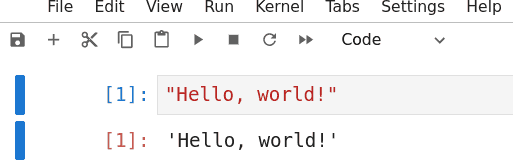
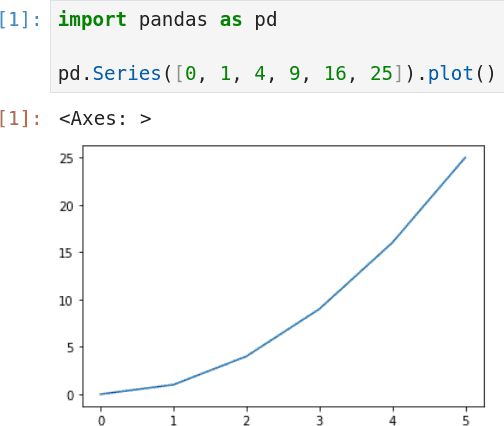

Notebooks
=========

Programs
--------

- We have created Python programs as complete text files in this course
- Text files can then be interpreted and run by the interpreter

REPL
----

- We have explored executing instructions directly in the Python REPL
- This can allow for quick exploration, but does not save work

Notebooks
---------

- Notebooks provide a way to instantly run segments of Python code and view output
- Notebook cell input and output can be saved, reviewed and updated

---

JupyterLab
----------

- [JupyterLab](https://jupyter.org/) is a popular Python notebook option
- It is free and open source
- It can be run locally or hosted

Google Colab
------------

- [Colab](https://colab.google/) provides hosted Python notebooks
- Notebooks can optionally use GPUs or other resources

Other Providers
---------------

- Many other options are available for both paid and free hosted notebook environments

Cells
-----

- Notebooks are broken into cells
- Cells can be rerun as needed update global state
- It is sometimes helpful to rerun all cells in order

Computational Thinking
----------------------

- CT involves breaking problems into computational steps and testing them
- Notebooks can provide a useful environment for some types of problem solving

Graphical Output
----------------

- In addition to outputting text, cells may also output graphics

Pandas
------

- Pandas is a Python package used for data analysis
- Among many other functions, it integrates the ability to plot date

---

Advent of Code Day 1
--------------------
